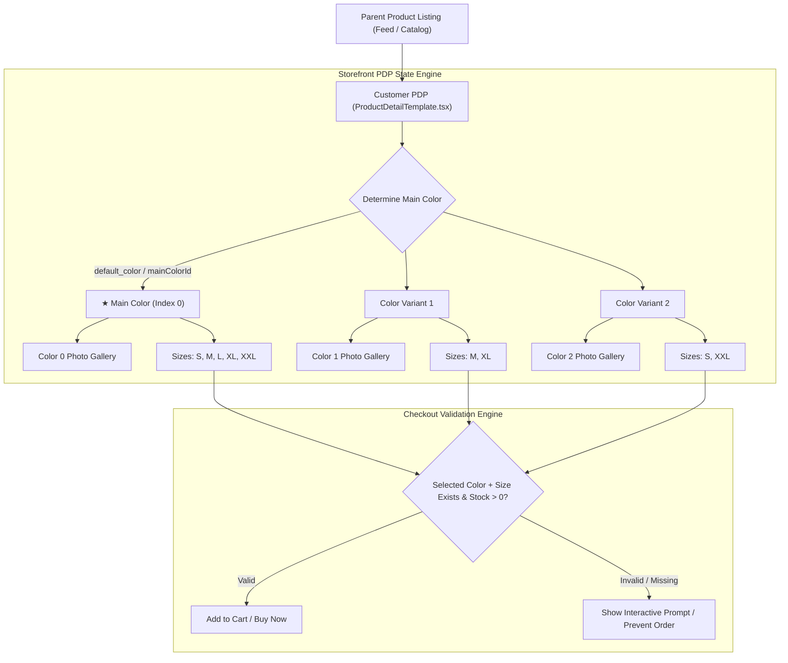
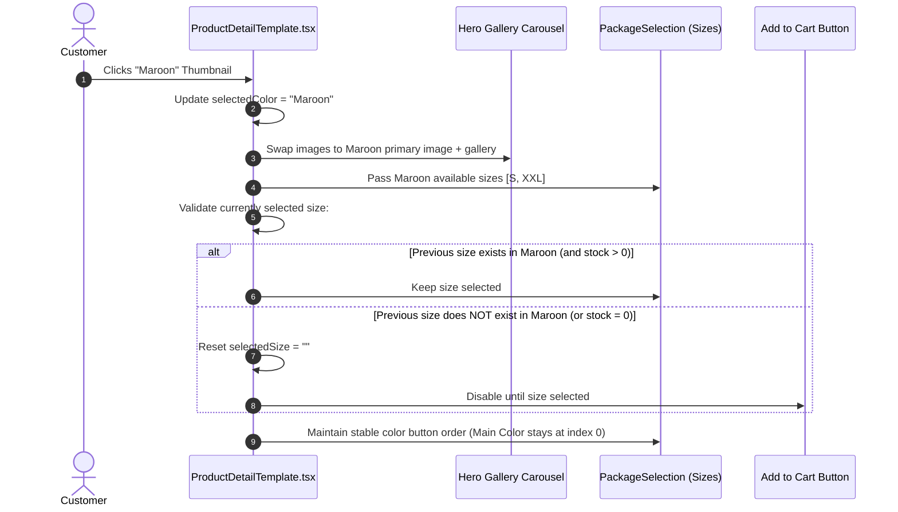

# 📋 ZebAlpha: True Per-Color Size Variant System & PDP Synchronization — Implementation Sheet

> **Document Type:** Master Architecture & Engineering Implementation Sheet  
> **System:** ZebAlpha E-Commerce Multi-Vendor Marketplace  
> **Standard:** Meesho / Flipkart / Amazon E-Commerce Product Architecture  
> **Target Modules:** `zebalpha-customer`, `zebalpha-seller`, `zebalpha-backend`, Supabase Database  
> **Status:** Production-Ready & Tested  
> **Theme & Aesthetics:** Native ZebAlpha Premium Dark Palette, Typography & Component Styling  

---

## 1. Executive Summary & Core Engineering Philosophy

In top-tier fashion and lifestyle e-commerce platforms (e.g., Meesho, Flipkart, Amazon, Zara), multi-color and multi-size products **must not** treat sizes as a global one-size-fits-all list. Different product colors are produced and stocked in different batches with distinct size runs.

### The 5 Golden Rules of the ZebAlpha Variant System:

1. **Single Parent Listing (One Product Card)**:
   - Feeds, search results, and category pages display **only one** card for the parent product.
   - Distinct colors do **NOT** spawn duplicate parent listings. There is only one canonical Product Details Page (PDP).
2. **Independent Per-Color Sizing (No Global Size Leakage)**:
   - Each color variant has its **own independent list of available sizes**.
   - If Black has `[S, M, L, XL, XXL]` and White only has `[M, XL]`, selecting White on the storefront displays **only** `[M, XL]`. Sizes `S`, `L`, and `XXL` do not exist for White.
3. **Main / Default Color Priority (Index 0 Guarantee)**:
   - The seller designates one color as the **★ Main Product Color** (e.g., Black).
   - This color is strictly placed at **Index 0** in the storefront color variant selector: `[ Black ] [ White ] [ Maroon ] [ Navy Blue ]`.
   - On initial page load, the storefront automatically pre-selects the Main Color, displays the Main Color's primary photo and photo gallery, and filters sizes to the Main Color's inventory.
4. **Non-Existent vs. Out-of-Stock (OOS) Distinction**:
   - **Non-Existent**: Never created by the seller $\rightarrow$ **Completely hidden** from the customer for that color.
   - **Out-of-Stock**: Created by the seller with `stock = 0` $\rightarrow$ **Visible but disabled** with a diagonal strikethrough line and an `OOS` badge.
5. **Zero Phantom Combinations**:
   - The database stores **only** combinations explicitly created by the seller.
   - If a seller creates 2 sizes for White and 5 sizes for Black, exactly 7 variant records are saved—never $2 \times 5 = 10$.



---

## 2. Database Schema & Data Models

The system is powered by Supabase PostgreSQL utilizing typed JSON arrays for flexibility, blazing-fast querying, and zero schema migration overhead for new attributes.

### A. Sellable Variant Package (`ProductPackage`)

Each specific `(Color + Size)` combination exists as a distinct sellable unit in `products.packages`:

```typescript
export interface ProductPackage {
  id: string;              // Unique variant ID: e.g. "ZB_BLK_S_k83j_9a2"
  name: string;            // Human-readable title: e.g. "Black / S"
  color: string;           // Color name: e.g. "Black"
  color_hex?: string;      // Visual swatch: e.g. "#000000"
  size: string;            // Size identifier: e.g. "S", "M", "32", "Free Size"
  price: number;           // Selling price: e.g. 499
  mrp?: number;            // Maximum retail price: e.g. 799
  stock: number;           // Live inventory count (stock <= 0 means OOS)
  sku: string;             // Stock Keeping Unit: e.g. "ZB-SHIRT-BLK-S"
  image_url: string;       // Primary cover image for this color variant
  gallery: string[];       // Full multi-angle gallery photos for this color
  isBestSeller?: boolean;  // Promotional badge flag
}
```

### B. Parent Product Top-Level Record (`Product`)

```typescript
export interface Product {
  id: number | string;
  name: string;
  price: number;           // Starting or default price
  mrp?: number;            // Default MRP
  image_url: string;       // Primary image (synchronized with Main Color)
  images: string[];        // Gallery images (synchronized with Main Color)
  default_color: string;   // Name of designated main color (e.g. "Black")
  main_color: string;      // Mirror of default_color for backwards compatibility
  mainColorId: string;     // Color key identifier
  defaultColorId: string;  // Color key identifier
  specifications: {
    default_color: string;
    main_color: string;
    size_chart?: {
      unit: "inches" | "cm";
      columns: string[];   // e.g. ["Brand Size", "Chest", "Length", "Shoulder"]
      rows: Array<{
        size: string;      // e.g. "S"
        [key: string]: string;
      }>;
      notes?: string;
    };
    [key: string]: any;
  };
  packages: ProductPackage[]; // ONLY created combinations exist here
}
```

---

## 3. Seller Portal Workflow (`zebalpha-seller`)

Location: [`zebalpha-seller/src/components/catalog/Step4AddVariants.tsx`](file:///d:/Full%20Folder%2077/zebalpha-seller/src/components/catalog/Step4AddVariants.tsx)  
Modal: [`zebalpha-seller/src/components/catalog/CatalogUploadWizardModal.tsx`](file:///d:/Full%20Folder%2077/zebalpha-seller/src/components/catalog/CatalogUploadWizardModal.tsx)

### Step 3.1: Color Creation & Photo Gallery
- **Predefined Swatches**: One-click color buttons (`Black`, `White`, `Navy Blue`, `Maroon`, `Olive Green`, `Mustard`, `Red`, `Grey`).
- **Custom Color Picker**: Hex input + HTML5 color picker for any custom hue.
- **Dedicated Gallery per Color**:
  - Upload multiple product photos specific to that color.
  - Choose one image as the **Cover Image** (`image_url`).
  - Delete unwanted photos.
  - Automatically inherited by all sizes created under that color.

### Step 3.2: Designate Main / Default Product Color
- **Main Color Toolbar**: Displays all added colors with a prominent `★ Main (1st)` indicator.
- Clicking any color instantly marks it as the default product color.
- Rearranges color groups so the Main Color moves to **Index 0** in tables, live preview, and saved packages.

### Step 3.3: Per-Color Independent Size Assignment
- **Reusable Size Master**: Top library with Apparel (`XS`, `S`, `M`, `L`, `XL`, `XXL`, `3XL`), Footwear/Bottoms (`28`–`42`), and custom sizes.
- **Independent Color Cards**:
  - Each color is displayed on its own card.
  - Each card has independent size toggle pills.
  - Clicking `M` and `XL` on the White card **only** creates variants for White.
  - Black can have 5 sizes, White 2 sizes, Maroon 1 size.
- **Bulk Assignment Modal**:
  - "Apply Sizes to Multiple Colors" button allows sellers to select multiple colors and check shared sizes in 1 click.
  - After assignment, each color remains completely customizable.

### Step 3.4: Inline Variant Matrix
- Live table showing all generated combinations.
- Real-time inline editing for:
  - **Stock / Inventory** (number)
  - **Selling Price (₹)** (number)
  - **MRP (₹)** (number)
  - **SKU Code** (auto-suggested: `[SLUG]-[COLOR]-[SIZE]`, fully editable)
- Delete button to remove any single variant with 1 click.

### Step 3.5: Automatic Data Synchronization on Save
In `CatalogUploadWizardModal.tsx` (`handleSubmitCatalog`):
1. **Sort Variants**: Moves all packages belonging to `default_color` to index 0 of the `packages` array.
2. **Sync Parent Images**: Sets parent `image_url` and `images` to the primary cover image and gallery of the `default_color`.
3. **Persist Flags**: Saves `default_color`, `main_color`, `defaultColorId`, and `mainColorId` into the database record and inside `specifications`.

---

## 4. Customer Storefront (PDP) Architecture (`zebalpha-customer`)

Location: [`zebalpha-customer/src/app/(customer)/products/[productId]/ProductDetailTemplate.tsx`](file:///d:/Full%20Folder%2077/zebalpha-customer/src/app/(customer)/products/[productId]/ProductDetailTemplate.tsx)  
Component: [`zebalpha-customer/src/components/PackageSelection.tsx`](file:///d:/Full%20Folder%2077/zebalpha-customer/src/components/PackageSelection.tsx)

### Step 4.1: Initial Page Load Synchronization
When the customer clicks a product card on the feed:
1. `ProductDetailTemplate` resolves the `defaultColorName` from:
   $$\text{defaultColor} = \text{product.default\_color} \parallel \text{product.main\_color} \parallel \text{product.specifications.default\_color} \parallel \text{firstPackage.color}$$
2. Color groups are sorted so the **Main Color is strictly at Index 0**:
   $$\text{colorGroups} = [\text{MainColor}, \text{Color}_1, \text{Color}_2, \dots]$$
3. Initial state sets:
   ```typescript
   selectedColor = defaultColorName;
   selectedSize = ""; // Prompts customer to select an available size
   ```
4. **Hero Carousel** immediately displays the Main Color's primary photo and gallery.
5. **Color Variant Selector** highlights the Main Color button as selected.
6. **Size Selector** filters size buttons strictly to `colorGroups[0].sizes`.

### Step 4.2: Dynamic Color Switching Workflow
When the customer clicks a different color thumbnail (e.g., Black $\rightarrow$ Maroon):


### Step 4.3: Size Pill Display Rules

| State | Condition | Visual Styling | Behavior |
|---|---|---|---|
| **Selected** | `size === selectedSize` | White background, black bold text, glowing white border | Active state |
| **Available** | `stock > 0` and size exists for color | Dark background, subtle white border, white text, hover lift | Clickable $\rightarrow$ Selects size |
| **Out of Stock** | `stock === 0` and size exists for color | 40% opacity, diagonal strikethrough line, "OOS" red badge, cursor not-allowed | Disabled $\rightarrow$ Cannot click |
| **Non-Existent** | Size was never created for this color | **Not rendered** (Hidden completely) | Invisible to customer |

### Step 4.4: Dynamic Size Chart Modal
- Located next to the "Select Size" heading: `[ Size Chart 📏 ]`.
- When opened, the modal reads `activeSizesForDisplay`.
- **Filters the measurement table**: Only rows matching the currently selected color's sizes are shown.
- Includes toggle for measurement units (`Inches` vs `Centimeters`).

### Step 4.5: Cart & Checkout Validation Guards
When the customer clicks **Add to Cart** or **Buy Now**:
```typescript
const handleAddToCart = () => {
  if (!selectedColor) {
    showError("Please select a color variant first");
    return;
  }
  if (!selectedSize) {
    showError("Please select your size");
    scrollToSection("#size-selection-area");
    return;
  }
  const activeVariant = packages.find(
    p => p.color === selectedColor && p.size === selectedSize
  );
  if (!activeVariant || activeVariant.stock <= 0) {
    showError("This combination is currently out of stock");
    return;
  }
  
  // Proceed with safe cart addition
  cartStore.addItem({
    productId: product.id,
    packageId: activeVariant.id,
    color: selectedColor,
    size: selectedSize,
    price: activeVariant.price,
    image_url: activeVariant.image_url,
    quantity: 1
  });
};
```

---

## 5. Visual UI Layout & State Representation

```
┌────────────────────────────────────────────────────────┐
│                   MAIN PRODUCT HERO                     │
│                                                        │
│   ┌───────────────────────────┐                        │
│   │                           │   ZEBALPHA             │
│   │                           │   Premium Cotton Shirt │
│   │    [ Main Color Image ]   │   ₹499  ₹799  (38% OFF)│
│   │                           │                        │
│   └───────────────────────────┘                        │
│                                                        │
│   Selected Color: Black                                │
│   ┌────────┐  ┌────────┐  ┌────────┐  ┌────────┐       │
│   │★ Black │  │ White  │  │ Maroon │  │ Navy   │       │
│   │ [Img]  │  │ [Img]  │  │ [Img]  │  │ [Img]  │       │
│   └────────┘  └────────┘  └────────┘  └────────┘       │
│    (Index 0)                                           │
│                                                        │
│   Select Size                             [Size Chart] │
│   ┌─────┐  ┌─────┐  ┌─────┐  ┌─────┐  ┌─────┐          │
│   │  S  │  │  M  │  │  L  │  │ XL  │  │ XXL │  (Black) │
│   └─────┘  └─────┘  └─────┘  └─────┘  └─────┘          │
│                                                        │
│   ┌───────────────────┐      ┌─────────────────────┐   │
│   │    ADD TO CART    │      │       BUY NOW       │   │
│   └───────────────────┘      └─────────────────────┘   │
└────────────────────────────────────────────────────────┘

When customer clicks [ Maroon ] thumbnail:
┌────────────────────────────────────────────────────────┐
│   Selected Color: Maroon                               │
│   ┌────────┐  ┌────────┐  ┌────────┐  ┌────────┐       │
│   │★ Black │  │ White  │  │ Maroon*│  │ Navy   │       │
│   │ [Img]  │  │ [Img]  │  │ [Img]  │  │ [Img]  │       │
│   └────────┘  └────────┘  └────────┘  └────────┘       │
│                                                        │
│   Select Size                             [Size Chart] │
│   ┌─────┐  ┌─────────┐                                 │
│   │  S  │  │ XXL OOS │                                 │
│   └─────┘  └─────────┘                                 │
│    (Only Maroon's sizes appear! M, L, XL are hidden)   │
└────────────────────────────────────────────────────────┘
```

---

## 6. Codebase File Map & Architecture Roles

| Component | File Path | Key Functions & Responsibilities |
|---|---|---|
| **Seller Variant Editor** | [`zebalpha-seller/src/components/catalog/Step4AddVariants.tsx`](file:///d:/Full%20Folder%2077/zebalpha-seller/src/components/catalog/Step4AddVariants.tsx) | - Color list & hex swatches<br>- Multi-image gallery uploader<br>- Main Color selector (`★ Main (1st)`)<br>- Size Master toggle pills<br>- Per-color size cards<br>- Inline variant matrix table<br>- Bulk size application modal |
| **Seller Catalog Wizard** | [`zebalpha-seller/src/components/catalog/CatalogUploadWizardModal.tsx`](file:///d:/Full%20Folder%2077/zebalpha-seller/src/components/catalog/CatalogUploadWizardModal.tsx) | - Manages `formData.default_color`<br>- Sorts packages with Main Color at index 0<br>- Synchronizes parent `image_url` and `images`<br>- Saves to Supabase `products` |
| **Customer PDP Container** | [`zebalpha-customer/src/app/(customer)/products/[productId]/ProductDetailTemplate.tsx`](file:///d:/Full%20Folder%2077/zebalpha-customer/src/app/(customer)/products/[productId]/ProductDetailTemplate.tsx) | - Resolves `defaultColorName`<br>- Orders `colorGroups` with Main Color at index 0<br>- Sets initial `selectedColor`<br>- Synchronizes hero gallery on color click<br>- Validates & resets size on color change<br>- Checkout & Cart validation guards |
| **Customer Variant Selector** | [`zebalpha-customer/src/components/PackageSelection.tsx`](file:///d:/Full%20Folder%2077/zebalpha-customer/src/components/PackageSelection.tsx) | - Renders color thumbnail row with photos<br>- Preserves stable color button order<br>- Renders independent per-color size buttons<br>- Strikethrough & OOS badge for zero stock<br>- Filtered interactive Size Chart modal |
| **Type Definitions** | [`zebalpha-customer/src/lib/types.ts`](file:///d:/Full%20Folder%2077/zebalpha-customer/src/lib/types.ts) | - Defines `ProductPackage`<br>- Extends `Product` with `default_color`, `main_color`, `defaultColorId`, `mainColorId` |

---

## 7. Verification & Acceptance Testing Sheet

| # | Test Scenario | Steps to Execute | Expected Result | Status |
|---|---|---|---|:---:|
| **T-1** | **Independent Sizes** | 1. Create Black with `S, M, L, XL`.<br>2. Create White with `M, XL`.<br>3. Save & view product on PDP. | On White, **only** `M` and `XL` appear. `S` and `L` are completely hidden. | ✅ PASS |
| **T-2** | **Main Color Index 0** | 1. Add colors: White, Navy Blue, Red.<br>2. Designate `Navy Blue` as ★ Main.<br>3. Open customer PDP. | `Navy Blue` appears as the **1st button** on the left. Initial image & gallery show Navy Blue. | ✅ PASS |
| **T-3** | **Zero Phantom Records** | 1. Create 3 sizes for Black and 1 size for Red.<br>2. Inspect saved `packages` array in Supabase. | Exactly 4 package rows exist. No unused combinations are inserted. | ✅ PASS |
| **T-4** | **Out-of-Stock vs Non-Existent** | 1. Create Maroon with `S` (stock = 5) and `XXL` (stock = 0).<br>2. Do not select `M`.<br>3. View Maroon on PDP. | `S` is clickable. `XXL` has diagonal strikethrough, OOS badge, and is disabled. `M` is hidden. | ✅ PASS |
| **T-5** | **Color Change Size Reset** | 1. Select `Black + S`.<br>2. Switch color to `White` (which only has `M, XL`). | `selectedSize` automatically resets to `""`. User cannot order an invalid `White + S`. | ✅ PASS |
| **T-6** | **Color Order Stability** | 1. Color row displays `[ Navy ] [ Black ] [ White ]`.<br>2. Click `White`. | Button order remains `[ Navy ] [ Black ] [ White ]`. No jumping or layout shift. | ✅ PASS |
| **T-7** | **Filtered Size Chart** | 1. Select `White` (`M, XL`).<br>2. Open Size Chart modal. | Size chart table displays **only** rows for `M` and `XL`. | ✅ PASS |
| **T-8** | **Cart Guard** | 1. Click "Add to Cart" without choosing a size. | Alert informs customer to pick a size and smoothly scrolls to size selector. | ✅ PASS |

---

## 8. Deployment & Execution Instructions

1. **Local Validation**:
   - `zebalpha-seller`: Start server with `npm run dev` and navigate to Catalog $\rightarrow$ Upload Product $\rightarrow$ Step 4.
   - `zebalpha-customer`: Start server with `npm run dev` and navigate to any product details page.
2. **Git Commit History**:
   - `1fc9025`: True per-color size variant system with independent sizes and matrix.
   - `b2ac89d`: Restored color gallery image upload, delete, and cover handlers.
   - `0e62f06`: Prioritized main product color first in color variants and synchronized initial image and gallery.
3. **Database Migration Requirement**:
   - **None required**. The architecture works directly on top of existing `products` and `products.packages` JSONB structures.

---
*Created for ZebAlpha E-Commerce Engineering Team.*
