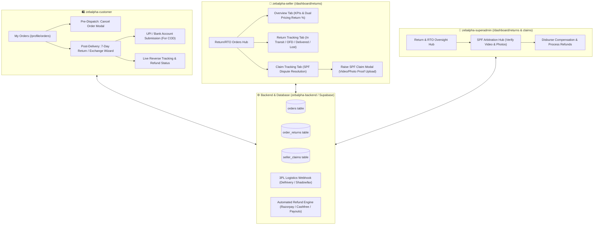

# ZEBALPHA x MEESHO-GRADE RETURN, CANCELLATION & SPF DISPUTE ENGINE
## Full-Stack Architecture & Implementation Specification

---

## 1. System Architecture Diagram



---

## 2. Database Schema (PostgreSQL / Supabase)

### A. Extended `orders` Table
```sql
ALTER TABLE public.orders 
ADD COLUMN IF NOT EXISTS cancellation_reason TEXT,
ADD COLUMN IF NOT EXISTS cancellation_comment TEXT,
ADD COLUMN IF NOT EXISTS cancelled_at TIMESTAMPTZ,
ADD COLUMN IF NOT EXISTS cancelled_by TEXT, -- 'customer' | 'seller' | 'admin' | 'system'
ADD COLUMN IF NOT EXISTS delivered_at TIMESTAMPTZ,
ADD COLUMN IF NOT EXISTS return_eligible_until TIMESTAMPTZ,
ADD COLUMN IF NOT EXISTS return_status TEXT, -- 'NONE' | 'REQUESTED' | 'IN_TRANSIT' | 'OUT_FOR_DELIVERY' | 'DELIVERED' | 'CANCELLED'
ADD COLUMN IF NOT EXISTS refund_status TEXT DEFAULT 'NONE', -- 'NONE' | 'PENDING' | 'INITIATED' | 'COMPLETED' | 'FAILED'
ADD COLUMN IF NOT EXISTS refund_amount NUMERIC(10,2) DEFAULT 0.00,
ADD COLUMN IF NOT EXISTS refund_mode TEXT DEFAULT 'ORIGINAL_SOURCE', -- 'ORIGINAL_SOURCE' | 'UPI' | 'BANK_TRANSFER'
ADD COLUMN IF NOT EXISTS upi_id TEXT;
```

### B. `order_returns` Table (Reverse Logistics & QC)
```sql
CREATE TABLE IF NOT EXISTS public.order_returns (
    id UUID PRIMARY KEY DEFAULT gen_random_uuid(),
    order_id TEXT NOT NULL,
    suborder_id TEXT NOT NULL,
    user_id UUID NOT NULL,
    seller_id TEXT NOT NULL,
    product_id TEXT NOT NULL,
    product_name TEXT,
    product_image TEXT,
    sku TEXT,
    category TEXT,
    size TEXT,
    quantity INT DEFAULT 1,
    
    return_type TEXT NOT NULL DEFAULT 'CUSTOMER_RETURN', -- 'CUSTOMER_RETURN' | 'RTO' | 'EXCHANGE'
    policy_type TEXT DEFAULT 'EASY_RETURN', -- 'EASY_RETURN' | 'DEFECTIVE_ONLY'
    status TEXT NOT NULL DEFAULT 'IN_TRANSIT', 
    -- 'IN_TRANSIT' | 'OUT_FOR_DELIVERY' | 'DELIVERED' | 'LOST' | 'NO_RETURN_NO_CHARGE' | 'DISPOSED' | 'CANCELLED'
    
    reason TEXT NOT NULL,
    sub_reason TEXT,
    customer_notes TEXT,
    customer_images JSONB DEFAULT '[]'::jsonb,
    
    -- Refund tracking
    refund_amount NUMERIC(10,2) NOT NULL DEFAULT 0.00,
    refund_mode TEXT DEFAULT 'ORIGINAL_SOURCE', -- 'ORIGINAL_SOURCE' | 'UPI' | 'BANK_TRANSFER'
    bank_details JSONB, -- { upi_id, account_number, ifsc_code, account_holder }
    refund_status TEXT DEFAULT 'PENDING', -- 'PENDING' | 'INITIATED' | 'COMPLETED' | 'FAILED'
    refund_id TEXT,
    
    -- Logistics & Tracking
    awb_number TEXT,
    courier_partner TEXT DEFAULT 'Delhivery', -- 'Delhivery' | 'Shadowfax' | 'Ekart' | 'Xpressbees'
    expected_delivery_date TIMESTAMPTZ,
    delivered_at TIMESTAMPTZ,
    return_shipping_fee NUMERIC(10,2) DEFAULT 0.00,
    pod_url TEXT, -- Proof of Delivery URL
    
    created_at TIMESTAMPTZ DEFAULT now() NOT NULL,
    updated_at TIMESTAMPTZ DEFAULT now() NOT NULL
);

CREATE INDEX IF NOT EXISTS idx_order_returns_seller_id ON public.order_returns(seller_id);
CREATE INDEX IF NOT EXISTS idx_order_returns_status ON public.order_returns(status);
CREATE INDEX IF NOT EXISTS idx_order_returns_awb ON public.order_returns(awb_number);
```

### C. `seller_claims` Table (Seller Protection Fund - SPF)
```sql
CREATE TABLE IF NOT EXISTS public.seller_claims (
    id UUID PRIMARY KEY DEFAULT gen_random_uuid(),
    claim_id TEXT UNIQUE NOT NULL, -- e.g., 'CLM-782194'
    return_id UUID REFERENCES public.order_returns(id),
    suborder_id TEXT NOT NULL,
    seller_id TEXT NOT NULL,
    product_id TEXT NOT NULL,
    product_name TEXT,
    product_image TEXT,
    
    claim_type TEXT NOT NULL, -- 'WRONG_ITEM' | 'DAMAGED_ITEM' | 'MISSING_QUANTITY' | 'EMPTY_PACKAGE' | 'FAKE_DELIVERY'
    claim_amount NUMERIC(10,2) NOT NULL,
    status TEXT NOT NULL DEFAULT 'OPEN', -- 'OPEN' | 'APPROVED' | 'REJECTED' | 'UNDER_REVIEW'
    
    seller_comments TEXT NOT NULL,
    unboxing_video_url TEXT,
    outer_box_image_url TEXT,
    item_damage_images JSONB DEFAULT '[]'::jsonb,
    
    -- Admin resolution
    approved_amount NUMERIC(10,2) DEFAULT 0.00,
    admin_remarks TEXT,
    resolved_by UUID,
    resolved_at TIMESTAMPTZ,
    
    created_at TIMESTAMPTZ DEFAULT now() NOT NULL,
    updated_at TIMESTAMPTZ DEFAULT now() NOT NULL
);

CREATE INDEX IF NOT EXISTS idx_seller_claims_seller_id ON public.seller_claims(seller_id);
CREATE INDEX IF NOT EXISTS idx_seller_claims_status ON public.seller_claims(status);
```

---

## 3. Seller Side Implementation (`zebalpha-seller`)

### Page: `/dashboard/returns` (Matches Meesho Supplier Screenshots 100%)

#### Tab 1: Overview Tab (Screenshot 2)
* **Summary KPI Cards:**
  * **Customer Return Card:** Return Rate `0.00%`, Avg. Reverse Shipping Cost `₹ 0`, "0 orders returned out of 2 delivered".
  * **Courier Return (RTO) Rate Card:** `33.33%` ("1 RTO orders out of 3 dispatched") with trend indicator.
  * **Dual Pricing - Customer Return Rate Card:** Wrong/Defective Return Price `0.00%`, Meesho Price `0.00%`.
  * **RTO Approved Claims Card:** Branded packaging incentive banner + "Buy Now" button.
* **Product Performance Table:**
  * Filters: Category, Performance filter, Sort by "Most Recent Order".
  * Columns: Product Details (Thumbnail, Title, Product ID, Category, Dual Pricing badge), Orders Delivered, Customer Return %, Action ("View Details" modal), What Changed.

#### Tab 2: Return Tracking Tab (Screenshots 1, 3, 4)
* **Status Sub-Tabs:**
  * `In transit` (0)
  * `Out for Delivery` (0)
  * `Delivered` (1)
  * `Lost` (0)
  * `No Return No Charge` [New badge] (0)
  * `Disposed` (0)
* **Filter Bar:**
  * Search Input: `Search by Order ID, SKU or AWB Number`
  * Filters: `Return Created`, `Category`, `Courier Partner`, `Return Type`, `All Filters`
  * Export: `0/0 files ready` button.
* **Row Data Fields (Delivered item):**
  * Product details with thumbnail, SKU ID, Category, Qty, Size.
  * Suborder ID (e.g. `324387803182751552_1`).
  * Return Reason.
  * Return Shipping Fee (`₹0`).
  * Delivered on date (with green tick icon).
  * AWB Number with Delhivery/Shadowfax courier tag.
  * Actions: `View Details`, `Download POD` button, and `Raise SPF Claim` (if within 72h).

#### Tab 3: Claim Tracking Tab (Screenshot 5)
* **SPF Status Tabs:**
  * `All (count)` | `Open (count)` | `Approved (count)` | `Rejected (count)`
* **Raise SPF Claim Modal:**
  * Suborder ID selector.
  * Dispute reason dropdown (Wrong Item, Damaged, Missing, Empty Box, Fake Delivery).
  * Video URL/Upload for unboxing.
  * Image uploads for outer shipping label and damaged item.
  * Claim Loss Amount (₹).
  * Terms confirmation checkbox.

---

## 4. Customer App Implementation (`zebalpha-customer`)

### A. Pre-Dispatch Cancellation
* Triggered in `/profile/orders` when status is `PENDING`, `CONFIRMED`, or `PROCESSING`.
* Reason dropdown (e.g. "Ordered by mistake", "Long delivery time", "Need to change address/size").
* Immediate refund acknowledgment for prepaid orders; instant cancellation for COD.

### B. 7-Day Return / Exchange Multi-Step Flow
* Available when order status is `DELIVERED` and within 7 calendar days.
* **Step 1: Choose Action** (`Return for Refund` or `Exchange for different Size/Color`).
* **Step 2: Choose Reason & Upload Photos** (Mandatory 2+ photos for damaged/defective items).
* **Step 3: Refund Destination** (Prepaid $\rightarrow$ Original Source; COD $\rightarrow$ Instant UPI ID or Bank Account fields).
* **Step 4: Doorstep QC Checklist** (Visual guide showing courier check requirements: tags attached, unused, original box).

---

## 5. SuperAdmin Arbitration Hub (`zebalpha-superadmin`)

### Route: `/dashboard/returns` and `/dashboard/claims`
* Real-time table of all returns across all sellers.
* SPF Dispute Arbitration Desk:
  * Watch seller unboxing video and view evidence photos.
  * Action: **Approve Claim** (Set compensation amount ₹) $\rightarrow$ automatically adds to seller payout ledger.
  * Action: **Reject Claim** (Set rejection reason sent to seller).
* Direct Payout Gateway execution (trigger instant IMPS / UPI payouts for COD refunds).

---

## 6. Implementation Sequence

1. **Step 1:** Run SQL Migration for `order_returns` and `seller_claims`.
2. **Step 2:** Build the complete Seller Portal pages (`/dashboard/returns` with all 3 tabs + SPF Modal + Layout menu link).
3. **Step 3:** Implement Customer Order Cancellation & 7-Day Return Modal in `zebalpha-customer`.
4. **Step 4:** Implement SuperAdmin Claims Arbitration page in `zebalpha-superadmin`.
5. **Step 5:** Connect API routes and automated state transitions.
