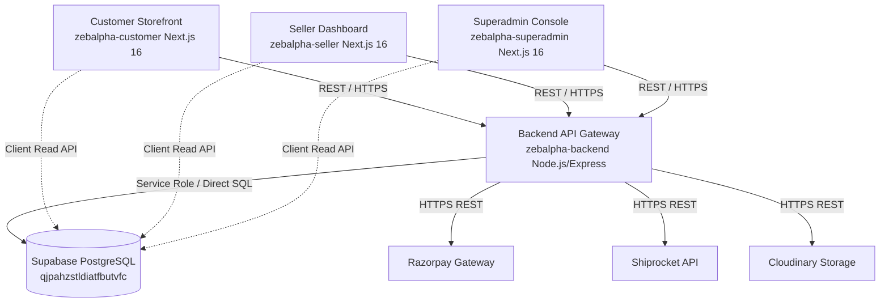

# ZEBALPHA — SECURITY ARCHITECTURE SPECIFICATION

**Application Name**: Zebalpha Multi-Vendor E-Commerce Platform  
**Architecture Model**: Micro-Frontend Next.js Workspaces with Centralized Node.js/Express API Gateway & Unified Supabase PostgreSQL Database  
**Document Status**: Production Verified  

---

## 1. System Component Overview

| Component | Framework / Stack | Responsibility | Port / Deployment |
|---|---|---|---|
| **zebalpha-customer** | Next.js 16 (App Router), React 19, TailwindCSS | Customer storefront, product catalog, cart, checkout, order tracking | Render Web Service |
| **zebalpha-seller** | Next.js 16 (App Router), React 19, TailwindCSS | Seller onboarding, inventory management, product listing, order packing & dispatch | Render Web Service |
| **zebalpha-superadmin** | Next.js 16 (App Router), React 19, TailwindCSS | Platform governance, seller approvals, settlement monitoring, logistics override | Render Web Service |
| **zebalpha-backend** | Node.js (v22), Express.js, pg, @supabase/supabase-js | Centralized API Gateway, authentication, Razorpay verification, Shiprocket logistics, DB transactions | Render Web Service (Port 5000) |
| **Database Layer** | Supabase PostgreSQL 15 | Unified multi-tenant data store (`orders`, `sellers`, `products`, `shipments`, `seller_pickup_locations`, `users`, `cards_loyalty`) | Supabase Cloud (aws-0-ap-south-1) |

---

## 2. Authentication Architecture

Zebalpha enforces **Dual Cryptographic Authentication**:
1. **Internal Application JWT**: Signed via `config.jwt.secret` using `HS256`. Transmitted via `Authorization: Bearer <token>`.
2. **Supabase Auth Gateway Validation**: `supabase.auth.getUser(token)` fallback verification against the Supabase Auth service.
3. **Admin Cookie Auth**: Superadmin panel uses HTTP session cookies verified server-side against environment admin keys (`ADMIN_ACCESS_KEY_1`, `ADMIN_ACCESS_KEY_2`).

---

## 3. Authorization & Multi-Tenant Isolation Model

- **Customer Isolation**: Orders and customer data are bound to `user_id`. Access to `/orders/:id` requires `req.user.id === order.user_id`.
- **Seller Isolation**: Products, inventory logs, and seller orders are bound to `seller_id`. Updates to `/products/:id` or `/shipments` verify that the caller owns the resource (`req.user.id === seller.user_id` or `order.seller_id === seller.id`).
- **Superadmin Governance**: Protected by RBAC middleware `requireRole(['super_admin'])`. Superadmin endpoints override tenant boundaries for platform administration.

---

## 4. Payment Architecture (Razorpay)

1. **Order Initiation**: Frontend sends item IDs & quantities to `/api/checkout/create-razorpay-order`.
2. **Server-Side Price Calculation**: Backend fetches authoritative product prices directly from PostgreSQL, calculates subtotal, shipping, and tax, and creates the order using Razorpay SDK (`razorpay.orders.create`).
3. **Verification**: Upon checkout completion, `/api/checkout/verify-payment` verifies the HMAC-SHA256 signature using `crypto.createHmac('sha256', RAZORPAY_KEY_SECRET)` before marking an order as `PAID`.
4. **Webhooks**: `/api/webhooks/razorpay` verifies `X-Razorpay-Signature` against `RAZORPAY_WEBHOOK_SECRET` with idempotent processing.

---

## 5. Storage & Asset Architecture

- **Product Images & Seller Documents**: Uploaded via Cloudinary SDK or Supabase Storage buckets (`products`, `documents`).
- **Public Assets**: Product images are served via Cloudinary CDN or public Supabase Storage buckets.
- **Private Identity Documents**: KYC and seller identity documents are restricted to authenticated sellers and superadmins.
