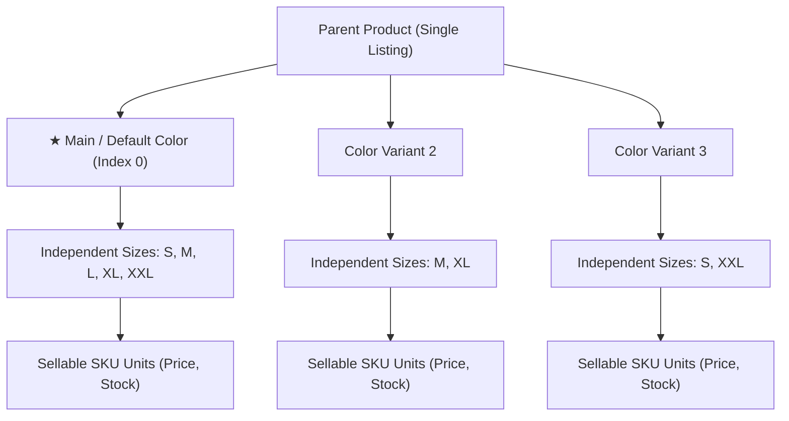

# 📋 ZebAlpha: True Per-Color Size Variant System — Implementation Sheet

> **E-Commerce Variant Architecture Blueprint (Meesho / Flipkart Standard)**  
> **Target Project:** ZebAlpha E-Commerce Platform  
> **Status:** Production-Ready & Fully Implemented  
> **Design & Theme:** 100% Native ZebAlpha Dark Aesthetic, Typography, and Performance  

---

## 1. Executive Summary & Core Principle

In top tier e-commerce platforms like **Meesho, Flipkart, and Amazon**, clothing and lifestyle products operate on a **Single Parent Product + Independent Color Variants + Independent Sizes** model:



### Key Rules:
1. **One Single Listing**: There is only **one** product card on feeds/catalog and **one** Product Details Page (PDP). Colors do NOT create duplicate products.
2. **Independent Per-Color Sizing**: Every color has its **own** size availability. Selecting `S, M, L, XL, XXL` for Black does NOT force those sizes onto White or Maroon.
3. **No Phantom Combinations**: If the seller created `White + M` and `White + XL`, the database contains only those 2 rows. Unselected combinations (like `White + S`) do **not** exist in the database, even with `stock = 0`.
4. **Main Color Always First**: The designated main product color is always at **Index 0** in the color selector and controls the initial image, gallery, sizes, and pricing.
5. **Non-Existent vs. Out-of-Stock Distinction**:
   - **Non-Existent**: Never created by seller $\rightarrow$ **Completely hidden** from the customer for that color.
   - **Out-of-Stock**: Created by seller but inventory reached 0 $\rightarrow$ **Shown with strikethrough line + "OOS" badge + disabled**.

---

## 2. System Architecture & Data Schema

### A. Database Entity Structure (`ProductPackage` in `products.packages`)
Each sellable unit is stored in the `products.packages` JSON array:

```typescript
export interface ProductPackage {
  id: string;              // e.g. "ZB_BLK_S_k83j_9a2"
  name: string;            // e.g. "Black / S"
  color: string;           // e.g. "Black"
  color_hex?: string;      // e.g. "#000000"
  size: string;            // e.g. "S"
  price: number;           // e.g. 499
  mrp?: number;            // e.g. 799
  stock: number;           // e.g. 15 (if 0 => OOS)
  sku: string;             // e.g. "ZB-BLK-S"
  image_url: string;       // Primary cover image for this color
  gallery: string[];       // Photo gallery for this color
  isBestSeller?: boolean;  // Featured flag
}
```

### B. Parent Product Top-Level Fields

```typescript
export interface Product {
  id: number | string;
  name: string;
  price: number;
  mrp?: number;
  image_url: string;       // Set to the Main / Default Color's primary image
  images: string[];        // Gallery photos of the Main / Default Color
  default_color: string;   // e.g. "Black"
  main_color: string;      // e.g. "Black"
  mainColorId: string;     // e.g. "Black"
  defaultColorId: string;  // e.g. "Black"
  specifications: {
    default_color: string;
    main_color: string;
    size_chart?: {
      unit: "inches" | "cm";
      columns: string[];
      rows: Array<Record<string, any>>;
      notes?: string;
    };
  };
  packages: ProductPackage[]; // ONLY contains created combinations
}
```

---

## 3. Seller Catalog Wizard Flow

The seller configures the catalog in **Step 4: Variants & Size Chart**:

### Step 4.1: Add Colors
- Pre-made swatches: Black, White, Navy Blue, Red, Olive Green, Maroon, Mustard, etc.
- Custom Color input with HTML5 color picker.
- Each color receives its own gallery uploader (upload multiple photos, set primary cover, delete photos).

### Step 4.2: Select Main / Default Color
- A dedicated **★ Main / Default Color** toolbar lets the seller click one color (e.g. `Black`).
- The chosen color immediately jumps to **Index 0** across all tables, previews, and database outputs.

### Step 4.3: Per-Color Independent Size Assignment
- **Reusable Size Master**: Standard sizes (`XS`, `S`, `M`, `L`, `XL`, `XXL`, `3XL`, `Free Size`), waist sizes (`28`–`42`), and custom sizes.
- **Per-Color Cards**: Each color card has its own row of size pills. Clicking `M` and `XL` for White only creates `White + M` and `White + XL`.
- **Inline Editing Table**: For each created variant, the seller edits Stock, Price, MRP, and SKU directly.
- **Bulk Creation Modal**: "Apply Sizes to Multiple Colors" button allows selecting multiple colors and applying common sizes in 1 click, while retaining individual editability afterwards.

### Step 4.4: Live Storefront Simulator
- Built-in PDP preview updates in real time when colors or sizes are toggled.
- Sellers immediately see what customers will see before publishing.

---

## 4. Customer Storefront (PDP) Synchronization

### A. Initial Page Load
1. **Index 0 Priority**: `colorGroups` sorts the `product.default_color` or `mainColorId` to index 0.
2. **Initial State**: `selectedColor` defaults to `colorGroups[0].colorName`.
3. **Hero Carousel**: Automatically displays that color's primary photo and gallery.
4. **Size Selector**: Automatically filters available size pills strictly to `colorMap.get(selectedColor)`.
5. **Price & Stock**: Displays that specific color variant's pricing and inventory.

### B. Color Switching Behavior
When a customer clicks a different color thumbnail (e.g., Black $\rightarrow$ Orange):
1. `selectedColor` updates to Orange.
2. Hero Carousel swaps instantly to Orange's photo gallery.
3. Size buttons re-render with Orange's available sizes.
4. **Size Validation Guard**:
   - If previous size was `L` and Orange also has `L` (in stock) $\rightarrow$ `L` remains selected.
   - If Orange does not have `L` (or `L` is OOS) $\rightarrow$ `selectedSize` is automatically reset to `""` to prevent invalid combinations.
5. **Order Stability**: The color thumbnail row retains its original ordering (`[ Black ] [ Orange ] [ Red ] ...`) to prevent distracting layout shifts.

### C. Size Chart Modal Filtering
- The Size Chart modal dynamically inspects `activeSizesForDisplay`.
- It filters the measurement table rows to **only display rows corresponding to sizes available in the selected color**.

### D. Cart & Checkout Guards
Before calling `AddToCart` or `BuyNow`:
$$\text{Valid Purchase} = (\text{selectedColor} \neq "") \land (\text{selectedSize} \neq "") \land (\text{variantExists} = \text{true}) \land (\text{stock} > 0)$$
If any condition fails, an alert highlights the missing selection and scrolls smoothly to the section.

---

## 5. Visual Comparison: States & UI Representation

| State | Seller Action | Storefront UI Representation | Clickable? |
|---|---|---|---|
| **Available Variant** | Created size with `stock > 0` | White box, bold text, price tag | ✅ Yes (Selects variant) |
| **Out of Stock (OOS)** | Created size with `stock = 0` | Muted background, strikethrough diagonal line, "OOS" badge | ❌ No (Disabled) |
| **Non-Existent Variant** | Size never selected for this color | **Completely hidden** (Not rendered) | ❌ Not visible |

---

## 6. Implementation Code Map

| File Path | Role in Architecture |
|---|---|
| [`Step4AddVariants.tsx`](file:///d:/Full%20Folder%2077/zebalpha-seller/src/components/catalog/Step4AddVariants.tsx) | Per-color cards, Size Master library, Main Color selector, inline variant matrix, bulk modal, gallery uploader. |
| [`CatalogUploadWizardModal.tsx`](file:///d:/Full%20Folder%2077/zebalpha-seller/src/components/catalog/CatalogUploadWizardModal.tsx) | Synchronizes default color with cover image, sorts variant packages with main color at index 0, persists to Supabase. |
| [`ProductDetailTemplate.tsx`](file:///d:/Full%20Folder%2077/zebalpha-customer/src/app/(customer)/products/[productId]/ProductDetailTemplate.tsx) | PDP container: Main color resolution, hero gallery synchronization, color-switch size recalculation, cart guards. |
| [`PackageSelection.tsx`](file:///d:/Full%20Folder%2077/zebalpha-customer/src/components/PackageSelection.tsx) | Ecommerce color thumbnail row with photos, independent size buttons with OOS strikethrough, filtered Size Chart. |
| [`types.ts`](file:///d:/Full%20Folder%2077/zebalpha-customer/src/lib/types.ts) | TypeScript definitions for `Product`, `ProductPackage`, `default_color`, `main_color`. |

---

## 7. QA & Testing Verification Checklist

- [x] **Verification 1: Independent Sizing**
  - Create Black with `S, M, L, XL, XXL`.
  - Create White with `M, XL`.
  - Verify that selecting White on PDP shows **only** `M` and `XL`. `S`, `L`, and `XXL` do not appear.
- [x] **Verification 2: Non-Existent vs OOS**
  - Create Maroon with `S` (stock = 10) and `XXL` (stock = 0).
  - Verify Maroon shows `S` as active and `XXL` as disabled with strikethrough & OOS badge. `M`, `L`, `XL` are hidden.
- [x] **Verification 3: Main Color Index 0**
  - Designate `Olive Green` as Main Color.
  - Verify `Olive Green` is at position 0 in the color selector on PDP.
  - Verify PDP opens with `Olive Green` hero photo and gallery by default.
- [x] **Verification 4: Color Change Auto-Reset**
  - Select `Black + L`.
  - Click `White` (which only has `M, XL`).
  - Verify `selectedSize` clears automatically; user cannot purchase an impossible `White + L` variant.
- [x] **Verification 5: Filtered Size Chart**
  - Open Size Chart when `White` is selected.
  - Verify table displays measurement rows exclusively for `M` and `XL`.
