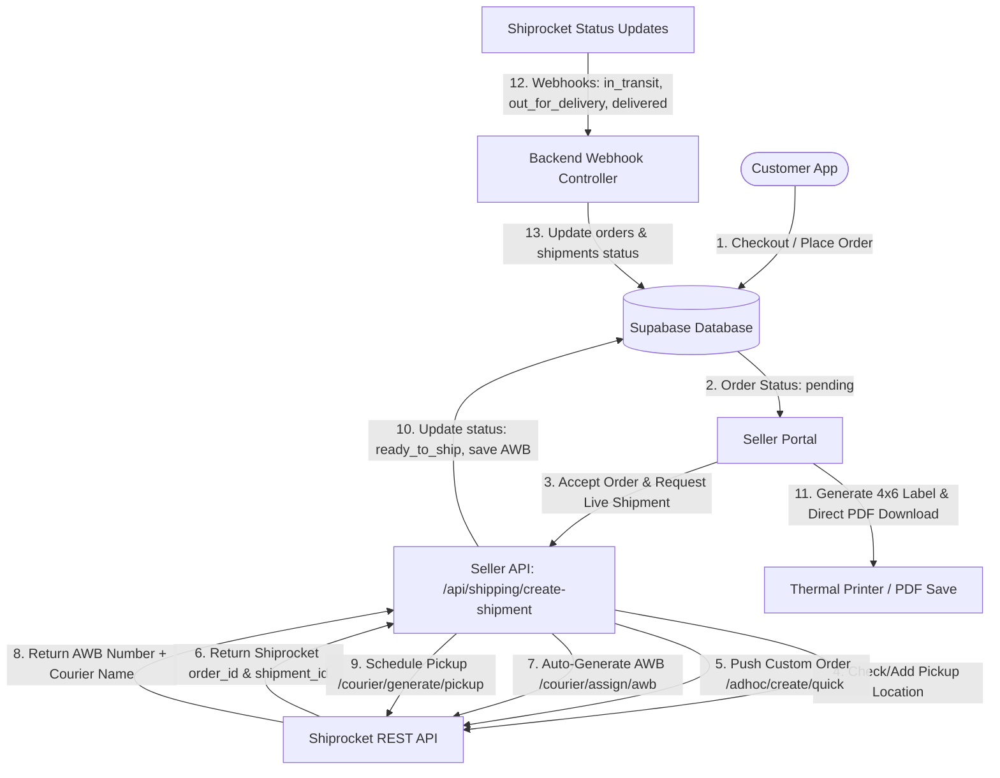

# Zebalpha x Shiprocket Logistics Implementation Architecture

> **Document Type:** Technical Architecture & Workflow Guide  
> **System:** Zebalpha Multi-Vendor Marketplace  
> **Logistics Partner:** Shiprocket API  
> **Database:** Supabase (PostgreSQL)  
> **Last Updated:** October 2026

---

## 1. Executive Summary & Architecture Overview

Zebalpha integrates Shiprocket for automated, multi-vendor order fulfillment across India. The ecosystem connects **four primary components**:

1. **Customer Web App (`zebalpha-customer`)**:
   - Pushes cart checkouts to Supabase `orders` and `order_items` with status `pending`.
   - Offers real-time shipment tracking for customers via tracking URLs / AWBs.
2. **Seller Portal (`zebalpha-seller`)**:
   - Next.js 14 App Router portal where sellers view incoming orders.
   - Manages pickup addresses, accepts orders, auto-assigns couriers, generates live AWBs, schedules pickups, and produces 4x6" PDF shipping labels.
3. **Backend API (`zebalpha-backend`)**:
   - Node.js / Express microservice containing standalone `shiprocketService.js` and `shipmentController.js`.
   - Handles background webhooks, tracking updates, and automated rate calculations.
4. **Supabase Database**:
   - Central state engine (`orders`, `order_items`, `shipments`, `sellers`, `seller_pickup_locations`).



---

## 2. Complete Order-to-Delivery Lifecycle

### Phase 1: Order Placement (`zebalpha-customer`)
1. Customer selects products, enters delivery address (street, city, state, pincode, phone), and pays or chooses Cash on Delivery (COD).
2. Customer app inserts records into:
   - `orders`: `id`, `order_number` (e.g., `AS202610021550`), `seller_id`, `customer_id`, `total_amount`, `payment_method`, `order_status = 'pending'`, `delivery_address`.
   - `order_items`: `order_id`, `product_id`, `quantity`, `price`.
3. Order appears on the Seller Portal under the **Orders** page (`/dashboard/orders`).

---

### Phase 2: Order Acceptance & Shipment Creation (`zebalpha-seller`)
1. Seller navigates to `/dashboard/orders`.
2. Under "Action Required", seller clicks **ACCEPT & SHIP**.
3. Seller frontend calls internal route:
   `POST /api/shipping/create-shipment`
4. The route executes the following sequential steps via [shiprocket.ts](file:///d:/Full%20Folder%2077/zebalpha-seller/src/shared/utils/shiprocket.ts):

#### A. Pickup Location Resolution
- Queries Supabase `seller_pickup_locations` for the seller.
- If no custom location exists, falls back to the seller's registered address in `sellers`.
- Verifies location with Shiprocket via `GET /v1/external/settings/company/pickup`.
- If the pickup location does not exist in Shiprocket, calls `POST /v1/external/settings/company/addpickup`.
  - Enforces `country: "India"`.
  - Formats address with street prefixes if needed to satisfy Shiprocket regex validation.
  - **Graceful Fallback**: If `addpickup` returns any error (e.g. 422), automatically falls back to Shiprocket's verified `"Primary"` hub to guarantee shipment flow never breaks.

#### B. Shiprocket Order Creation
- Calls `POST /v1/external/orders/create/adhoc` with:
  ```json
  {
    "order_id": "AS202610021550",
    "order_date": "2026-10-02 19:00",
    "pickup_location": "Primary",
    "billing_customer_name": "Rahul Adhikary",
    "billing_address": "Vill: Nadia, P.O: West Bengal",
    "billing_city": "Nadia",
    "billing_pincode": "741254",
    "billing_state": "West Bengal",
    "billing_country": "India",
    "billing_phone": "9883637054",
    "shipping_is_billing": true,
    "order_items": [...],
    "payment_method": "Prepaid",
    "sub_total": 450,
    "length": 15, "breadth": 15, "height": 10, "weight": 0.5
  }
  ```
- Receives Shiprocket `order_id` (e.g. `962283086`) and `shipment_id` (e.g. `957813204`).

#### C. Live Courier Assignment & AWB Generation
- Calls `POST /v1/external/courier/assign/awb`:
  ```json
  { "shipment_id": "957813204" }
  ```
- Shiprocket assigns best courier (e.g. **Ekart Logistics Surface**, **Delhivery**, **Blue Dart**, **Blr-Blr Express**).
- Returns live `awb_code` (e.g. `SRSP2619793786`) and `courier_name`.

#### D. Pickup Request Scheduling
- Calls `POST /v1/external/courier/generate/pickup`:
  ```json
  { "shipment_id": ["957813204"] }
  ```
- Schedules courier executive arrival at the seller's pickup location for the next morning.

#### E. Supabase Database Synchronization
- Updates Supabase `orders`:
  - `order_status = 'ready_to_ship'`
  - `courier = 'Ekart Logistics Surface'`
  - `awb_number = 'SRSP2619793786'`
  - `shiprocket_shipment_id = '957813204'`
  - `shiprocket_order_id = '962283086'`
- Inserts/Updates Supabase `shipments`:
  - `tracking_number = 'SRSP2619793786'`
  - `courier_name = 'Ekart Logistics Surface'`
  - `status = 'ready_to_ship'`
  - `pickup_address_snapshot = { ... }`
  - `delivery_address_snapshot = { ... }`

---

### Phase 3: Label Printing & Direct PDF Download (`zebalpha-seller`)
1. On `/dashboard/orders`, the order now displays the **LABEL** button.
2. Clicking **LABEL** opens [ShippingLabelModal.tsx](file:///d:/Full%20Folder%2077/zebalpha-seller/src/components/ShippingLabelModal.tsx):
   - Features standard **4x6" e-commerce dispatch label format** compliant with Meesho/Amazon/Flipkart shipping specs:
     - Customer Address & Phone
     - Return / Seller Address
     - Courier Name & Routing Codes
     - High-density Barcode (`SRSP2619793786`) & QR code
     - SKU item summary, prepaid / COD declaration
3. **Actions Provided**:
   - **Download Label (PDF)**: Uses `html2canvas` + `jspdf` to convert the label DOM directly into an ultra-sharp 4x6" (101.6mm x 152.4mm) PDF saved directly to the seller's downloads folder (`Shipping_Label_[ORDER]_[AWB].pdf`).
   - **Print Label**: Uses an isolated, styled `<iframe>` to trigger the browser's native print dialog without blank-page preview glitches caused by modal CSS backdrops.

---

### Phase 4: Carrier Pickup & In-Transit Tracking
1. The assigned courier executive arrives at the seller's pickup address and scans the AWB barcode on the package.
2. Shiprocket automatically receives courier pickup event and updates status to `in_transit`.
3. Shiprocket triggers registered Webhook URL or periodic polling runs via [shipmentController.js](file:///d:/Full%20Folder%2077/zebalpha-backend/src/controllers/shipmentController.js).
4. `orders.order_status` and `shipments.status` become `shipped` / `in_transit`.
5. Customer can see real-time checkpoints (Hub departures, arrivals) inside `zebalpha-customer/src/app/(customer)/profile/orders/page.tsx`.

---

### Phase 5: Out for Delivery & Final Delivery
1. Package reaches destination delivery hub and is assigned to the last-mile delivery agent.
2. Shiprocket status updates to `out_for_delivery`.
3. Delivery executive completes delivery (or collects COD cash if applicable).
4. Shiprocket sends `DELIVERED` event.
5. Supabase `orders.order_status` updates to `delivered`.
6. Settlement & seller payout cycle activates.

---

## 3. Key File Connections & Code Locations

| Component | File Path | Function / Responsibility |
|---|---|---|
| **Seller Shiprocket Helper** | [shiprocket.ts](file:///d:/Full%20Folder%2077/zebalpha-seller/src/shared/utils/shiprocket.ts) | Core utility containing `getShiprocketToken()`, `createShiprocketOrder()`, `generateAwb()`, `requestPickup()`, `createPickupLocation()`, and `getPickupLocations()`. |
| **Seller API Route** | [create-shipment/route.ts](file:///d:/Full%20Folder%2077/zebalpha-seller/src/app/api/shipping/create-shipment/route.ts) | Server-side API endpoint receiving order acceptance, resolving seller pickup location, orchestrating Shiprocket APIs, and writing to Supabase. |
| **Seller Orders UI** | [orders/page.tsx](file:///d:/Full%20Folder%2077/zebalpha-seller/src/app/dashboard/orders/page.tsx) | Order management table, status filters, "Accept & Ship" trigger, and modal opener. |
| **Label & PDF Modal** | [ShippingLabelModal.tsx](file:///d:/Full%20Folder%2077/zebalpha-seller/src/components/ShippingLabelModal.tsx) | 4x6" label rendering, SVG barcode generation, iframe print handler, and client-side `jspdf` direct download. |
| **Backend Service** | [shiprocketService.js](file:///d:/Full%20Folder%2077/zebalpha-backend/src/services/shiprocketService.js) | Backend Node.js equivalent for background jobs, serviceability checks, tracking lookups, and token caching. |
| **Backend Controller** | [shipmentController.js](file:///d:/Full%20Folder%2077/zebalpha-backend/src/controllers/shipmentController.js) | Express controller for Shiprocket webhooks, status sync, and tracking endpoints. |
| **Customer Orders UI** | [orders/page.tsx](file:///d:/Full%20Folder%2077/zebalpha-customer/src/app/(customer)/profile/orders/page.tsx) | Customer order history, live courier status, and AWB tracking links. |

---

## 4. Environment Variables Required

Ensure these environment variables are set across `.env.local` in `zebalpha-seller` and `.env` in `zebalpha-backend`:

```env
# Shiprocket Credentials
SHIPROCKET_EMAIL=your-shiprocket-email@domain.com
SHIPROCKET_PASSWORD=your-shiprocket-account-password

# Supabase Credentials (Service Role required for API routes)
NEXT_PUBLIC_SUPABASE_URL=https://your-project.supabase.co
NEXT_PUBLIC_SUPABASE_ANON_KEY=eyJhbGci...
SUPABASE_SERVICE_ROLE_KEY=eyJhbGci...
```

---

## 5. Database Schema Reference

### `orders` Table (Key Logistics Columns)
- `id` (uuid, primary key)
- `order_number` (text, unique, e.g. `AS202610021550`)
- `seller_id` (uuid, references `sellers.id`)
- `order_status` (text: `pending`, `ready_to_ship`, `shipped`, `in_transit`, `out_for_delivery`, `delivered`, `cancelled`)
- `courier` (text, e.g. `Ekart Logistics Surface`)
- `awb_number` (text, e.g. `SRSP2619793786`)
- `shiprocket_order_id` (text / int8)
- `shiprocket_shipment_id` (text / int8)
- `delivery_address` (jsonb / text)

### `shipments` Table
- `id` (uuid, primary key)
- `order_id` (uuid, references `orders.id`)
- `seller_id` (uuid, references `sellers.id`)
- `tracking_number` (text, matches `awb_number`)
- `courier_name` (text)
- `status` (text)
- `pickup_address_snapshot` (jsonb)
- `delivery_address_snapshot` (jsonb)
- `label_url` (text, optional)

### `seller_pickup_locations` Table
- `id` (uuid, primary key)
- `seller_id` (uuid, references `sellers.id`)
- `pickup_location_name` (text, e.g. `Primary` or store nickname)
- `name` (contact person name)
- `email` (contact email)
- `phone` (10-digit mobile number)
- `address` (street address)
- `city` (city name)
- `state` (state name)
- `pincode` (6-digit postal code)
- `is_primary` (boolean)

---

## 6. Common Pitfalls & How They Are Resolved

1. **Pincode / Location Mismatch**:
   - If a seller registers with an unserviceable or misspelled pincode, Shiprocket rejects `addpickup` with HTTP 422.
   - **Resolution**: Zebalpha implements a fallback chain to Shiprocket's verified `"Primary"` hub so the order is never stranded.
2. **Blank Print Preview**:
   - Fixed modals with `backdrop-filter: blur` and `position: fixed` hide child content in Chrome/Edge print viewports.
   - **Resolution**: Zebalpha generates a hidden isolated `<iframe>` containing purely the 4x6" label HTML with standard `@page { size: 4in 6in; margin: 0; }` before calling `iframe.contentWindow.print()`.
3. **Shiprocket Slip Button**:
   - Shiprocket's default slip requires a secondary call and is frequently unavailable immediately upon order creation.
   - **Resolution**: Removed external slip dependency; sellers get instant local 4x6" PDF generation using `jspdf` and `html2canvas` directly in the browser.
