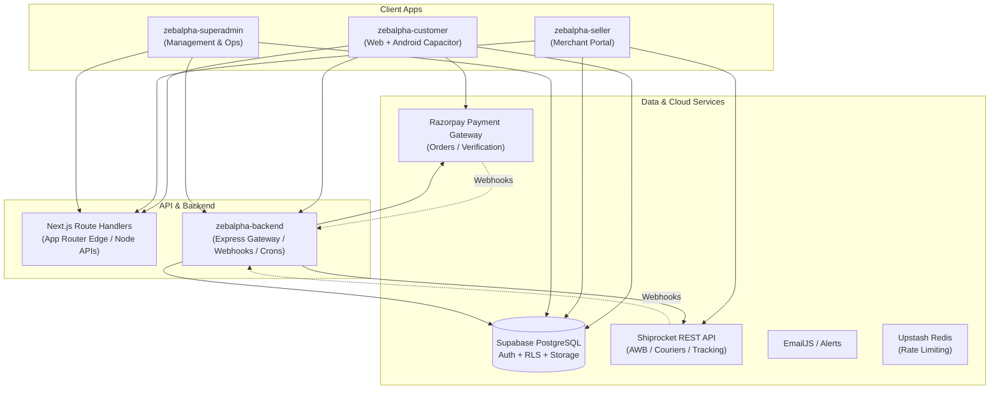
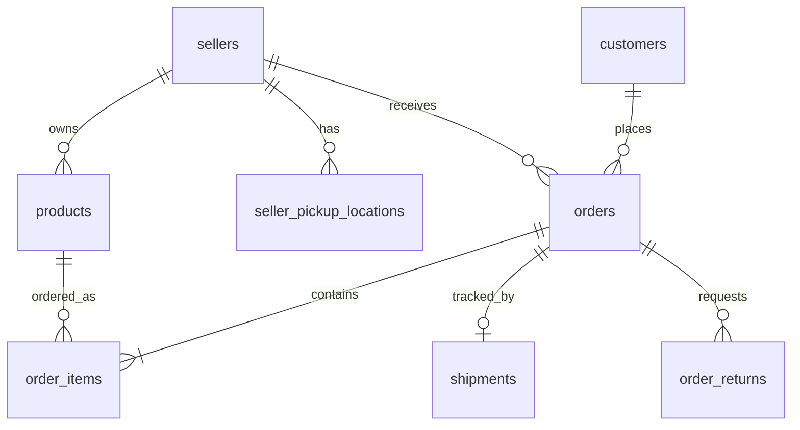

# ZEBALPHA — MASTER PROJECT BRAIN & ARCHITECTURE SPECIFICATION (`projectbrain.md`)

> **CONFIDENTIAL & PROPRIETARY**  
> **Platform:** ZEBALPHA E-Commerce Ecosystem (Multi-Vendor Marketplace)  
> **Target Audience:** Developers, AI Agents, DevOps, System Architects  
> **Primary Purpose:** Comprehensive, single-source-of-truth document describing architecture, apps, data models, API connections, logistics, auth, and development conventions so no future full-codebase scan is ever needed.

---

## 1. High-Level Ecosystem Overview

ZEBALPHA is a full-stack, multi-tenant e-commerce platform operating across India. It supports multi-vendor selling (similar to Meesho/Flipkart/Amazon), dynamic commission calculations, automated logistics via Shiprocket, Razorpay online payments, Cash on Delivery (COD), AI-driven virtual try-on, and real-time order/inventory synchronization.



---

## 2. Monorepo Structure & Application Roles

The repository is configured as an npm workspaces monorepo:

```
Full Folder 77/
├── package.json              # Monorepo root workspaces config
├── render.yaml               # Cloud deployment specs (4 micro-services on Render)
├── implement.md              # Detailed Shiprocket logistics implementation
├── projectbrain.md           # [THIS FILE] Complete ecosystem architectural knowledge base
│
├── zebalpha-customer/        # Customer Web & Mobile App (Port 3000)
├── zebalpha-seller/          # Seller/Merchant Dashboard & Order Processing (Port 3001)
├── zebalpha-superadmin/      # Platform Owner / Governance Portal (Port 3002)
├── zebalpha-backend/         # Express.js Core Backend & Cron Microservice (Port 5000)
├── shared/                   # Shared types, constants, utilities across apps
└── supabase/                 # Database migrations, schemas, RLS policies, seeds
```

---

## 3. Deep Dive: Component Applications

### A. `zebalpha-customer` (Storefront & Mobile App)
- **Framework:** Next.js 16 (App Router, React 19, Tailwind CSS).
- **Mobile Stack:** `@capacitor/core`, `@capacitor/android` (compiles to native Android APK/AAB).
- **Core Features:**
  - Product browsing, category filtering, search, and infinite pagination.
  - Cart and Wishlist with persistent local/Supabase storage.
  - Razorpay checkout integration + COD support with OTP verification.
  - Customer profile, saved addresses, and live order tracking.
  - Virtual Try-On feature (`add_virtual_tryon_support.sql`).
  - Rate limiting via `@upstash/ratelimit` & `@upstash/redis`.
- **Key Entry Points:**
  - `src/app/page.tsx` — Main storefront homepage.
  - `src/app/(customer)/checkout/` — Payment & address checkout flow.
  - `src/app/(customer)/profile/orders/` — Customer order history and tracking.
  - `src/services/` — Customer client-side API clients.

### B. `zebalpha-seller` (Merchant / Seller Portal)
- **Framework:** Next.js 16 (React 19, Tailwind CSS, Zustand, Lucide icons).
- **Core Features:**
  - Seller onboarding, KYC, GST/PAN validation, and bank detail management.
  - Product catalog management (listing products, variants, images, stock).
  - Multi-tier order management: `pending` -> `ready_to_ship` -> `shipped` -> `delivered`.
  - **Live Logistics Hub**: Auto pickup location verification, one-click Shiprocket AWB generation, courier allocation, and pickup scheduling.
  - **Thermal 4x6" Label Generation & Direct PDF Download**: Client-side label generation via `jspdf` + `html2canvas` and glitch-free printing via isolated iframes.
- **Key Entry Points:**
  - `src/app/dashboard/orders/page.tsx` — Seller order fulfillment center.
  - `src/app/api/shipping/create-shipment/route.ts` — Server route handling Shiprocket automation.
  - `src/components/ShippingLabelModal.tsx` — 4x6" standard shipping label preview & PDF engine.
  - `src/shared/utils/shiprocket.ts` — Shiprocket SDK / HTTP adapter for the seller portal.

### C. `zebalpha-superadmin` (Platform Operations & Control)
- **Framework:** Next.js 16 (React 19, Tailwind CSS, Lucide icons, xlsx report exports).
- **Security:** Double access-key gating (`ADMIN_ACCESS_KEY_1`, `ADMIN_ACCESS_KEY_2`) + admin JWT tokens.
- **Core Features:**
  - Global seller approval / ban / KYC verification.
  - Commission rates, fee rules, and category tax rates.
  - Global financial ledger, payouts to sellers, dispute resolution, and refunds.
  - System-wide inventory, product approvals, and banner management.
- **Key Entry Points:**
  - `src/app/dashboard/` — Super admin control room.
  - `src/app/api/admin/` — Protected admin endpoints.

### D. `zebalpha-backend` (Node.js / Express Gateway)
- **Framework:** Node.js (ES Modules, Express 4, `pg` direct client, `node-cron`, `helmet`, `cors`).
- **Core Features:**
  - Background scheduler (`node-cron`) for syncing courier statuses from Shiprocket.
  - Webhook listeners for Razorpay payment captures and Shiprocket logistics events.
  - Automated return and exchange lifecycles (`add_returns_and_cancellations_schema.sql`).
  - Direct PostgreSQL pooling via `aws-0-ap-south-1.pooler.supabase.com:5432`.
- **Key Entry Points:**
  - `src/app.js` & `server.js` — Express bootstrap and middleware stack.
  - `src/services/shiprocketService.js` — Backend Shiprocket token management and API wrapper.
  - `src/controllers/shipmentController.js` — Shipment lifecycle orchestration and tracking endpoints.
  - `src/routes/` — Modular REST route handlers.

---

## 4. Complete Database Architecture (Supabase PostgreSQL)

The database runs on Supabase (PostgreSQL 15+) with Row Level Security (RLS) policies enabled.

### Core Tables & Relationships



### Table Definitions & Key Attributes

#### 1. `sellers`
- `id` (UUID, PK, matches Supabase `auth.users.id`)
- `store_name`, `email`, `phone`, `gst_number`, `pan_number`
- `status` (`pending_approval`, `approved`, `suspended`)
- `commission_rate` (numeric)
- `registered_address` (text / jsonb)

#### 2. `seller_pickup_locations`
- `id` (UUID, PK)
- `seller_id` (UUID, FK -> `sellers.id`)
- `pickup_location_name` (text, e.g. `Primary` or warehouse code)
- `name`, `email`, `phone` (contact details)
- `address`, `city`, `state`, `pincode` (validated 6-digit postal code)
- `is_primary` (boolean)

#### 3. `orders`
- `id` (UUID, PK)
- `order_number` (text, unique e.g., `AS202610021550`)
- `seller_id` (UUID, FK -> `sellers.id`)
- `customer_id` (UUID, FK -> `auth.users.id` / `customers.id`)
- `total_amount`, `subtotal`, `shipping_charge`, `discount_amount`
- `payment_method` (`prepaid`, `cod`)
- `payment_status` (`pending`, `paid`, `failed`, `refunded`)
- `order_status` (`pending`, `ready_to_ship`, `shipped`, `in_transit`, `out_for_delivery`, `delivered`, `cancelled`)
- `delivery_address` (JSONB: name, street, city, state, pincode, phone)
- `courier` (text, e.g., `Ekart Logistics Surface`)
- `awb_number` (text, e.g., `SRSP2619793786`)
- `shiprocket_order_id` (bigint / text)
- `shiprocket_shipment_id` (bigint / text)
- `created_at`, `updated_at`

#### 4. `shipments`
- `id` (UUID, PK)
- `order_id` (UUID, FK -> `orders.id`)
- `seller_id` (UUID, FK -> `sellers.id`)
- `tracking_number` (text, matches AWB)
- `courier_name` (text)
- `status` (`ready_to_ship`, `in_transit`, `out_for_delivery`, `delivered`, `rto`)
- `pickup_address_snapshot` (JSONB)
- `delivery_address_snapshot` (JSONB)
- `label_url` (text, optional)

#### 5. `products` & `order_items`
- `products`: `id`, `seller_id`, `title`, `description`, `price`, `compare_at_price`, `stock`, `images`, `category_id`, `is_active`, `approval_status`.
- `order_items`: `id`, `order_id`, `product_id`, `quantity`, `price`, `selected_variant`.

---

## 5. End-to-End Logistics & Shiprocket Integration

Full operational details and code explanations are documented in [implement.md](file:///d:/Full%20Folder%2077/implement.md).

### The Golden Flow
1. **Order Acceptance**: Seller clicks **ACCEPT & SHIP** in `zebalpha-seller`.
2. **Pickup Resolution**: System verifies the seller's pickup address with Shiprocket; if not present or fails regex validation, falls back safely to `"Primary"`.
3. **Order Push**: Calls Shiprocket `POST /v1/external/orders/create/adhoc` and receives `shipment_id`.
4. **AWB Assignment**: Calls `POST /v1/external/courier/assign/awb` to lock in courier (Ekart, Delhivery, etc.) and generate live tracking AWB.
5. **Pickup Request**: Calls `POST /v1/external/courier/generate/pickup` to schedule driver pickup.
6. **Database State Sync**: Supabase updates `orders.order_status` to `'ready_to_ship'` and writes `awb_number` and courier details.
7. **Dispatch Label Generation**: Seller clicks **LABEL** to open the 4x6" standard shipping label. Clicking **Download Label (PDF)** instantly compiles a thermal-ready PDF via `jspdf`, while **Print** triggers an isolated iframe print preview without blank page bugs.

---

## 6. Payment & Financial Architecture (Razorpay + COD)

1. **Prepaid Flow (Razorpay)**:
   - Customer app initiates checkout -> calls `/api/payment/create-razorpay-order`.
   - Razorpay Order ID created with amount in paise.
   - Client opens Razorpay Modal. Upon success, client receives `razorpay_payment_id`, `razorpay_order_id`, and `razorpay_signature`.
   - Server validates HMAC SHA256 signature in `/api/payment/verify`.
   - Supabase `orders.payment_status` updated to `'paid'`.
2. **Cash on Delivery (COD)**:
   - Requires phone number OTP verification.
   - Order created with `payment_method = 'cod'`, `payment_status = 'pending'`.
   - Shiprocket order created with `payment_method: "COD"`, requiring courier to collect cash on delivery.

---

## 7. Authentication, Roles, & Permissions

1. **Supabase Auth**:
   - Manages JWTs for Customers and Sellers via `@supabase/ssr`.
   - Roles stored in `auth.users` metadata and mirrored in `public.sellers` and `public.customers`.
2. **Super Admin Auth**:
   - Independent dual-key validation with custom JWT signed using `ADMIN_JWT_SECRET`.
   - Protected routes in `zebalpha-superadmin` enforce valid session cookies before granting dashboard access.
3. **Database Security (RLS)**:
   - Strict policies in [harden_rls_policies.sql](file:///d:/Full%20Folder%2077/supabase/harden_rls_policies.sql) and [enable_rls_secure_policies.sql](file:///d:/Full%20Folder%2077/supabase/enable_rls_secure_policies.sql).
   - Sellers can only read/mutate their own products, pickup locations, and orders.
   - Customers can only read/mutate their own orders, cart, and profile.

---

## 8. Deployment & Infrastructure Setup

Configured in [render.yaml](file:///d:/Full%20Folder%2077/render.yaml):

| Service Name | Type | App Directory | Port / Runtime | Public Domain |
|---|---|---|---|---|
| `zebalpha-storefront` | Web Service | `zebalpha-customer` | Next.js (Node 22) | `zebalpha.shop` |
| `zebalpha-seller-panel`| Web Service | `zebalpha-seller` | Next.js (Port 3001) | `seller.zebalpha.shop` |
| `zebalpha-admin-panel` | Web Service | `zebalpha-superadmin`| Next.js (Port 3002) | `admin.zebalpha.shop` |
| `zebalpha-backend` | Web Service | `zebalpha-backend` | Express.js (Node 22) | `api.zebalpha.shop` |

---

## 9. Developer Rules & Conventions

When modifying any part of this repository:
1. **Never alter schema without checking RLS**: Always verify if a table column exists before issuing `update()` queries (e.g., `orders` does *not* have `shiprocket_error`).
2. **Shiprocket Address Validation**: Always pass `country: "India"`, ensure the address field contains street/house prefixes, and maintain a fallback to `"Primary"`.
3. **Print / PDF Generation**: Never rely on browser `@media print` over fixed/blurred modal backdrops. Always use an isolated `<iframe>` or client-side `jspdf` Canvas renderer.
4. **Git Commits**: Follow Conventional Commits (`feat:`, `fix:`, `docs:`, `perf:`). Keep working trees clean.
5. **Refer to `projectbrain.md`**: Treat this file as the master architecture blueprint before making structural decisions.
